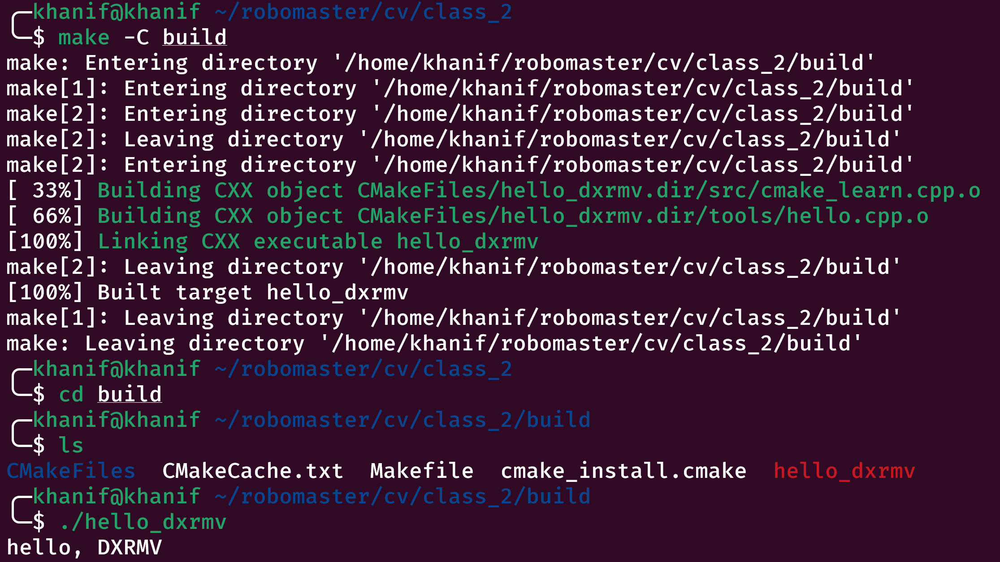

# Task01

This is the first assignment for the RoboMaster Vision Group, completed by Khan. I have successfully set up the development environment for **C++** and **OpenCV** in **WSL**. 

Figure 1 demostrates the successful installation of WSL(Ubuntu).

Figure 2 shows the output of "Hello, DXRMV".

